# System Architecture & Flow

```mermaid
graph TD
    A[Admin Uploads Excel] --> B[Prisma Backend creates Attendees]
    B --> C[QR Codes Generated]
    C --> D[Email sent to Attendee or Zip sent to Admin]

    D --> E[Attendee Arrives]
    E --> F[ENTRY_VOLUNTEER scans QR]
    
    F --> G{entryStatus == false?}
    G -- Yes --> H[Update entryStatus = true via transaction]
    H --> I[Log SUCCESS in ScanLog]
    G -- No --> J[Log DENIED in ScanLog]

    E --> K[FOOD_VOLUNTEER scans QR]
    K --> L{entryStatus == true AND foodStatus == false?}
    L -- Yes --> M[Update foodStatus = true via transaction]
    M --> N[Log SUCCESS in ScanLog]
    L -- No --> O[Log DENIED in ScanLog]
```

## Security Design

All scans and OTP verifications are protected by PostgreSQL transactions utilizing Prisma's `$transaction` mechanism. This guarantees no "double-scan" anomalies can occur, enforcing a strict 1-ticket = 1-entry and 1-food logic.

OTP relies on an isolated `OtpLog` structure. The OTP logs track expiration and verification strictly. Attempting to verify an OTP twice is hard-rejected by verifying the `used` flag.
